# SCCM (System Center Configuration Manager)

- [Windows Update - Patch Management & Deploy](#windows-update---patch-management--deploy) 
  - [Buscar updates](#buscar-updates)
  - [Crear grupo de updates](#crear-grupo-de-updates)
  - [Descargar grupo de updates](#descargar-grupo-de-updates)
  - [Desplegar grupo de updates en colecciones](#desplegar-grupo-de-updates-en-colecciones)
  - [Monitorización y alcance del despliegue de updates](#monitorización-y-alcance-del-despliegue-de-updates)
- [Windows Update - Deployment Plan](#windows-update---deployment-plan)

## Windows Update - Patch Management & Deploy 

### Buscar updates
Abrir plantilla de filtro para la búsqueda de Updates, podemos ajustar las fechas en caso de ser necesario.

- Software Library > Overview > All Software Updates > Saved Searches > All Updates W10 - Last month

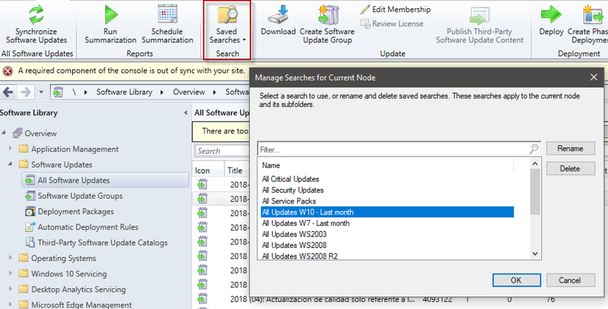

### Crear grupo de updates

Seleccionar todas las actualizaciones y crear un grupo de actualizaciones de software.

- Ctrl+A > Create Software Update Group

El nombre deberá corresponder al mes incluido en el que se aplican las últimas updates: "*W10 Updates MES-AÑO*"

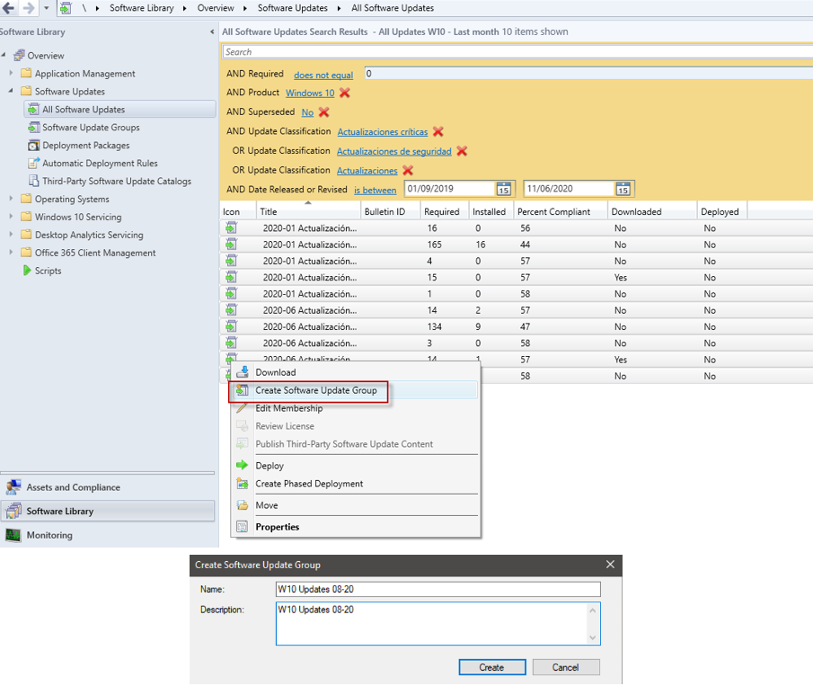

### Descargar grupo de updates

Esto genera un nuevo paquete con todas las colecciones, si es necesario se pueden ir agregando o modificando más updates a los paquetes. 

- Software Library > Overview > Software Updates Groups > Download

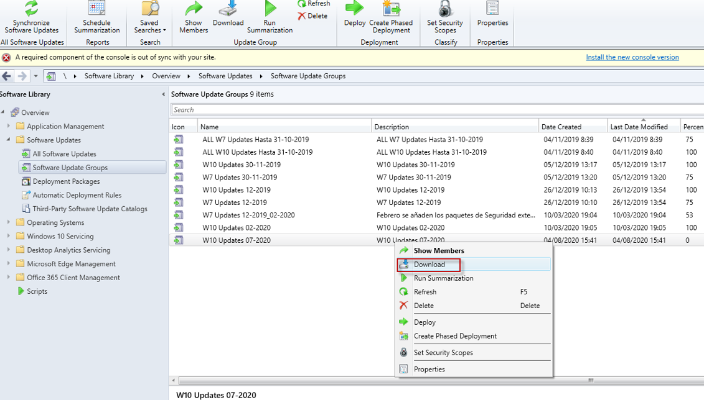

Se crea un nuevo paquete para ese grupo de updates. Se indica el path del servidor de SCCM donde se guardarán de forma local las updates.

Se crea una carpeta siguiendo la misma nomenclatura sustituyendo los espacios en blanco por guiones bajos.

- \\\SRVSCCM02\Descargas\Updates\CARPETA_MES-AÑO

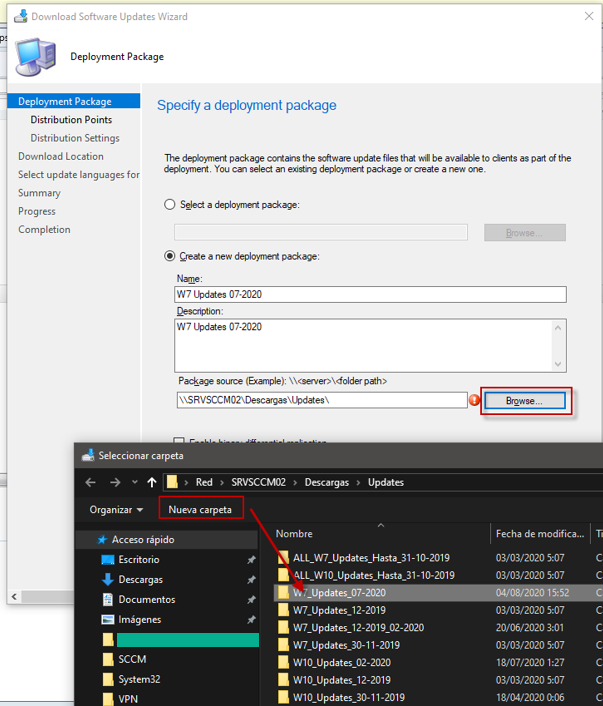

Se indica el propio servidor SCCM donde se descargan las nuevas updates desde internet por primera vez. Una vez que estén en almacenadas en localmente en el servidor serán los equipos clientes quienes soliciten las nuevas actualizaciones de Windows al servidor de SCCM y será este quien entregue los paquetes de updates correspondientes descargados según los requisitos de cada equipo cliente.

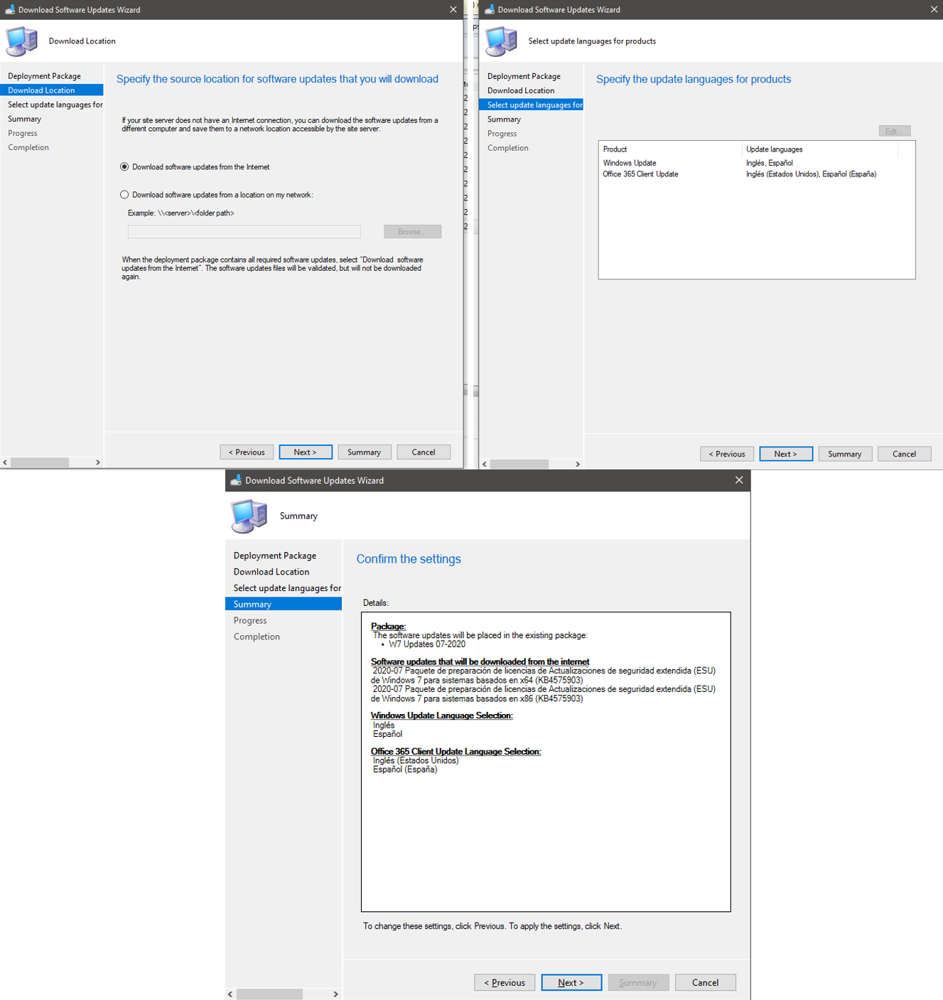

Se pueden tener varias descargas de updates de forma simultánea.

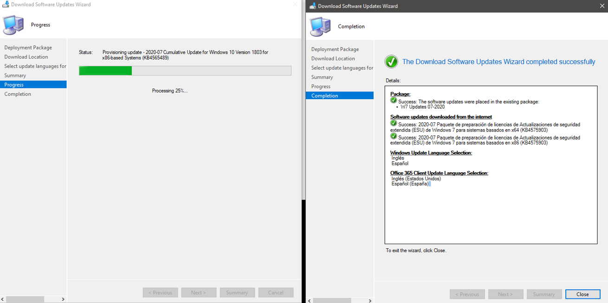

### Desplegar grupo de updates en colecciones

Del grupo de updates creado anteriormente se seleccionará para desplegar sobre las colecciones de equipos previamente definidas.

- Software Library > Overview > Software Updates > Software Update Groups > Seleccionar el grupo > Deploy

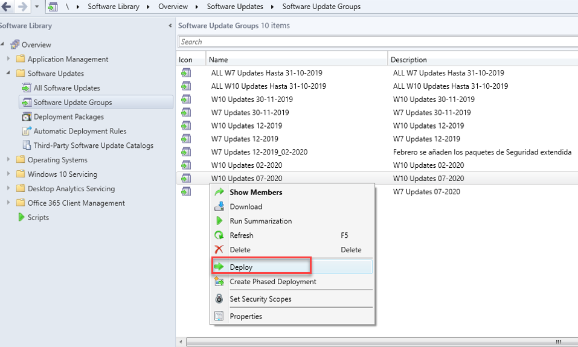

Establecer un *Template* o hacerlo manualmente y seleccionar la colección.

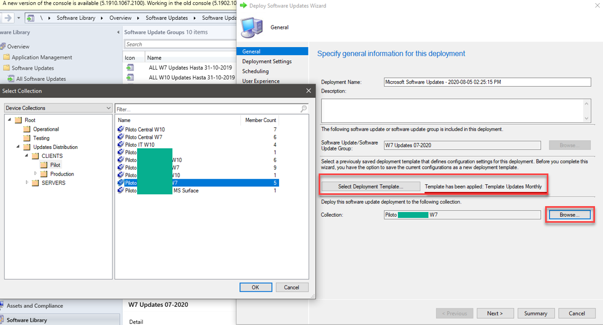

Se continua el asistente de despliegue con la siguiente configuración.

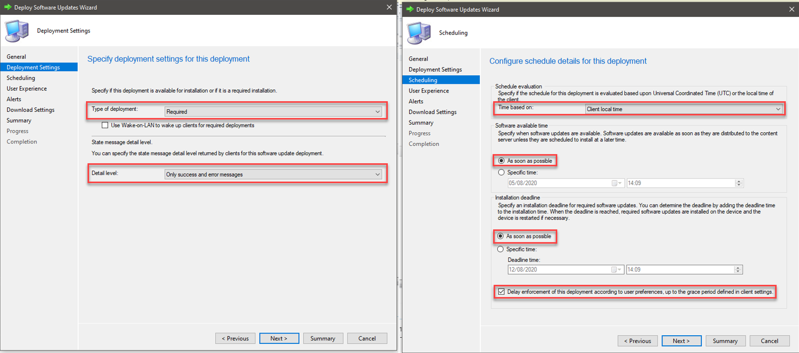

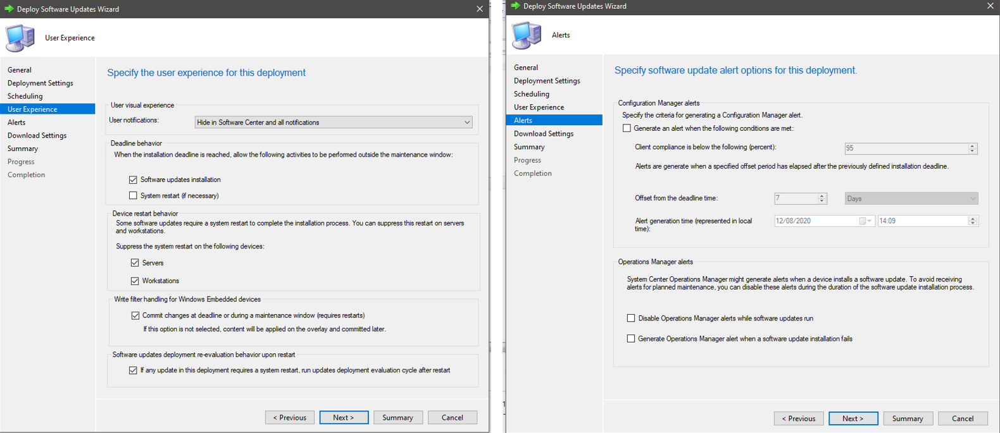

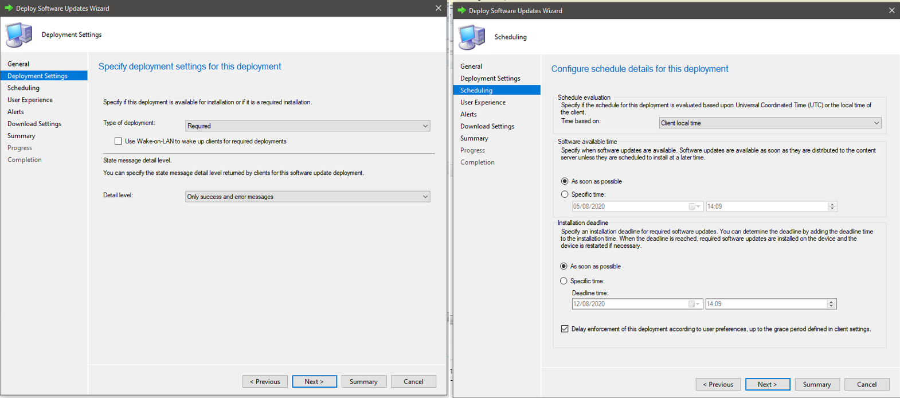

Se selecciona el grupo de updates. En la pestaña *Deployment* se puede ver la colección y el despliegue donde se ha lanzado, esto tendrá concordancia con el Monitoring > Deployment.

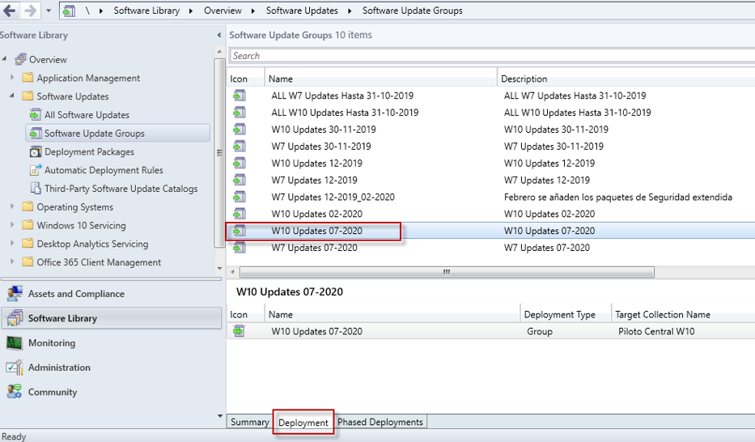

### Monitorización y alcance del despliegue de updates

Se puede ver el estado y el cumplimiento de alcance de los despliegues en las colecciones desde la sección *Monitoring* de SCCM.

- Monitoring > Overview > Deployments > Seleccionar el deploy y ver su estado. View Status.

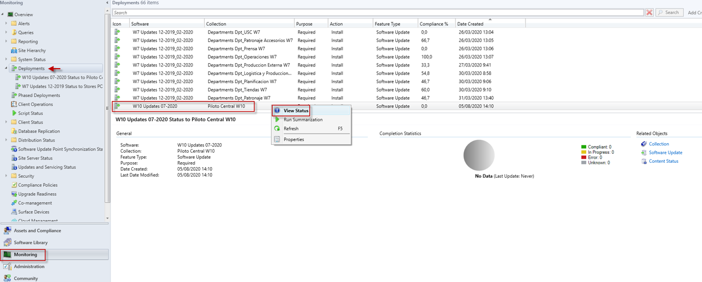

Se puede realizar un seguimiento más en detalle de cada uno de los despliegues, obteniendo información del estado en detalle por cada equipo (Compliant, In progress, Error), total assets, Last status time, etc. 

## Windows Update - Deployment Plan

Plan de despliegue de Windows Update. 

Plantilla de ejemplo de un calendario de 2020 en un escenario donde se compone de una sede central con un mayor parque de activos y varias sedes internacionales divididas en colecciones con un menor parque de activos.

-  [Deployment_Plan_WUpdates_Plantilla_Calendario_2020.xlsx](Deployment_Plan_WUpdates_Plantilla_Calendario_2020.xlsx)

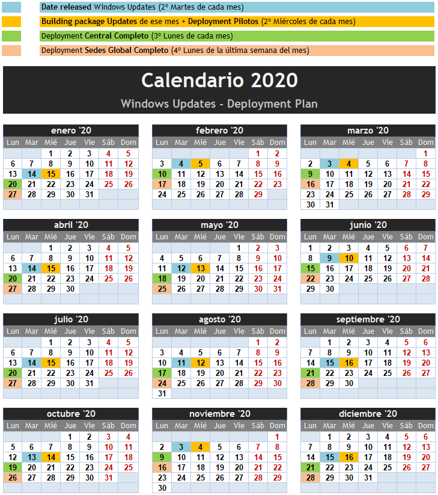
